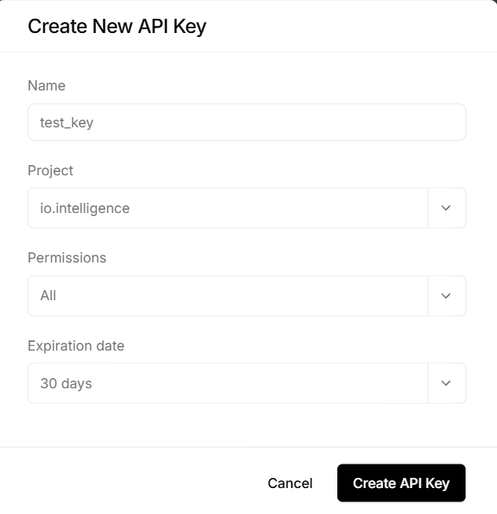

# 📚 Stepic Speedrun — Отчёт по проекту

> Автоматизированный бот для решения задач на платформе Stepik с использованием ИИ

---

## 📋 Содержание

1. [Описание проекта](#-описание-проекта)
2. [Требования к системе](#-требования-к-системе)
3. [Установка и настройка](#-установка-и-настройка)
4. [Конфигурация](#-конфигурация)
5. [Запуск программы](#-запуск-программы)
6. [Структура проекта](#-структура-проекта)
7. [Как это работает](#-как-это-работает)
8. [Устранение неполадок](#-устранение-неполадок)
9. [Безопасность](#-безопасность)
10. [Лицензия](#-лицензия)

---

## 🎯 Описание проекта

**Stepic Speedrun** — это Python-скрипт, который автоматически решает задания на образовательной платформе [Stepik](https://stepik.org) с помощью искусственного интеллекта.

### 🔑 Возможности:
- ✅ Автоматическое извлечение текста задания со страницы
- ✅ Отправка задания в ИИ (DeepSeek, OpenAI, Gemini и др.)
- ✅ Вставка полученного кода в редактор Stepik (CodeMirror)
- ✅ Автоматическая отправка решения на проверку
- ✅ Переход к следующему шагу после успешного решения
- ✅ Определение завершения курса
- ✅ Работа в изолированной Docker-среде
- ✅ Поддержка авторизации через cookies

### 🧩 Технологии:
| Компонент | Технология |
|-----------|-----------|
| Язык | Python 3.11 |
| Браузер | Google Chrome + Selenium |
| ИИ-провайдер | io.net (DeepSeek-V4-Flash) |
| Контейнеризация | Docker + Docker Compose |
| Зависимости | `selenium`, `requests`, `python-dotenv` |

---

## 💻 Требования к системе

### Для локального запуска:
```
✅ Операционная система: Windows 10/11, macOS, Linux
✅ Python 3.11 или выше
✅ Google Chrome (последняя версия)
✅ Интернет-соединение
✅ Аккаунт на Stepik
✅ API-ключ от io.net (или другого ИИ-провайдера)
```

### Для запуска в Docker:
```
✅ Docker Desktop 20.10+
✅ Docker Compose v2.0+
✅ 2 ГБ свободной оперативной памяти
✅ 5 ГБ свободного места на диске
```

---

## 🚀 Установка и настройка

### Способ 1: Локальный запуск (без Docker)

#### 1. Клонируйте репозиторий:
`git clone https://github.com/huksleva/stepic_speedrun`

#### 2. Создайте виртуальное окружение:
```powershell
# PowerShell (Windows)
python -m venv .venv
.venv\Scripts\Activate

# Linux/macOS
python3 -m venv .venv
source .venv/bin/activate
```

#### 3. Установите зависимости:
```bash
pip install -r requirements.txt
```

#### 4. Создайте файл `.env` в корне проекта:
```env
# Ссылка на первый шаг курса
START_URL=https://stepik.org/lesson/XXXXXX/step/1?unit=XXXXXX

# API-ключ для доступа к ИИ
API_KEY=io-v2-ваш_ключ_здесь

# Путь к папке с профилями Chrome
CHROME_PROFILE_PATH=C:\Users\<ВашеИмя>\AppData\Local\Google\Chrome\User Data\
```

#### 5. Как получить API_KEY

1. Зайти на сайт [io.net](io.net) и зарегистрируйтесь
2. Get started → CLOUD → INTELLIGENCE → API Keys and Secrets → Create New API Key
3. Вводите название для ключа → Create API Key

4. Копируете ваш API_KEY и вставляете его в файл `.env`


#### 6. Первая авторизация:
```bash
# Запустите скрипт локально (без Docker)
python main.py
```
- Откроется браузер — войдите в аккаунт Stepik
- После входа нажмите `Enter` в консоли
- Скрипт сохранит cookies в файл `cookies.json`

---

### Способ 2: Запуск в Docker (рекомендуется)

#### 1. Создайте файлы `Dockerfile` и `docker-compose.yml`:

**Dockerfile**:
```dockerfile
FROM python:3.11-bookworm

# Устанавливаем зависимости для Chrome
RUN apt-get update && apt-get install -y \
    wget \
    gnupg \
    ca-certificates \
    curl \
    unzip \
    libxss1 \
    libappindicator3-1 \
    libnss3 \
    libglib2.0-0 \
    libx11-6 \
    libxcomposite1 \
    libxdamage1 \
    libxrandr2 \
    libgbm1 \
    libxkbcommon0 \
    libgtk-3-0 \
    fonts-liberation \
    fonts-noto-color-emoji \
    xdg-utils \
    && rm -rf /var/lib/apt/lists/*

# Устанавливаем Chrome
RUN wget -q -O - https://dl-ssl.google.com/linux/linux_signing_key.pub | gpg --dearmor -o /usr/share/keyrings/google-chrome.gpg \
    && echo "deb [arch=amd64 signed-by=/usr/share/keyrings/google-chrome.gpg] http://dl.google.com/linux/chrome/deb/ stable main" > /etc/apt/sources.list.d/google-chrome.list \
    && apt-get update \
    && apt-get install -y google-chrome-stable \
    && rm -rf /var/lib/apt/lists/*

# ❌ УДАЛЯЕМ ручную установку ChromeDriver — Selenium Manager сделает это сам!

# Рабочая директория
WORKDIR /app

# Копируем зависимости
COPY requirements.txt .
RUN pip install --no-cache-dir -r requirements.txt

# Копируем код
COPY . .

# Переменные окружения
ENV CHROME_HEADLESS=true
ENV PYTHONUNBUFFERED=1
# Важно для Selenium Manager в Docker:
ENV SE_MANAGER_LOG_LEVEL=ERROR

# Запуск
CMD ["python", "main.py"]
```

**docker-compose.yml**:
```yaml
# docker-compose.yml
version: '3.8'

services:
  stepic-bot:
    build: .
    container_name: stepic_speedrun
    restart: unless-stopped
    environment:
      - START_URL=${START_URL}
      - API_KEY=${API_KEY}
      - CHROME_HEADLESS=true
    volumes:
      - .:/app
    stdin_open: true
    tty: true

    deploy:
      resources:
        limits:
          memory: 2g
        reservations:
          memory: 1g

    network_mode: bridge
```

#### 2. Создайте папку для cookies:
```powershell
mkdir cookies
```

#### 3. Соберите и запустите:
```powershell
# Сборка образа
docker-compose build

# Запуск
docker-compose up

# Или в фоновом режиме:
docker-compose up -d
```

#### 4. Просмотр логов:
```powershell
docker-compose logs -f
```

---

## ⚙️ Конфигурация

### Файл `.env` — основные переменные:

| Переменная | Описание | Пример                                   |
|-----------|----------|------------------------------------------|
| `START_URL` | Ссылка на первый шаг курса | `https://stepik.org/lesson/.../step/...` |
| `API_KEY` | Ключ доступа к ИИ-провайдеру | `io-v2-eyJhbGci...`                      |
| `CHROME_HEADLESS` | Запуск браузера без окна | `true` / `false`                         |

### Настройки ИИ в `templates/task.py`:

```python
payload = {
    "model": "deepseek-ai/DeepSeek-V4-Flash",  # Модель ИИ
    "temperature": 0.1,      # 0.0 = точно, 1.0 = креативно
    "max_tokens": 2048,      # Максимальная длина ответа
    "stream": False          # Ждать полный ответ
}
```

### Полезные параметры:

| Параметр | Рекомендуемое значение | Эффект |
|----------|----------------------|--------|
| `temperature` | `0.1` | Меньше ошибок в коде, но меньше креатива |
| `max_tokens` | `2048` | Достаточно для сложных задач, не разоряет |
| `timeout` (запрос) | `60` | Даёт время на генерацию длинных ответов |

---

## ▶️ Запуск программы

### Локально:
```powershell
# Активация окружения
.venv\Scripts\Activate

# Запуск
python main.py
```

### В Docker:
```powershell
# Запуск в фоне
docker-compose up -d

# Просмотр логов
docker-compose logs -f

# Остановка
docker-compose down
```

### Что вы увидите в логах:
```
🚀 Запуск Chrome с новым профилем...
📄 Страница: Запросы корректировки данных — Шаг 1 — Stepik
🔍 Функция next_page() запущена
✅ Задание выполнено
🤖 Отправляю задание ИИ...
✅ Ответ от ИИ получен (342 символов)
📝 Вставляю код в редактор...
✅ Код вставлен и синхронизирован
✅ Кнопка 'Отправить' нажата
⏳ Ожидание проверки решения...
✅ Результат найден: Вы получили: 1/1 балл
✅ Переход на следующий шаг выполнен!
```

---

## 📁 Структура проекта

```
stepic_speedrun/
│
├── main.py                 # Точка входа: инициализация, основной цикл
├── requirements.txt        # Зависимости Python
├── .env                    # Переменные окружения (не коммитить!)
├── .gitignore             # Исключения для Git
├── .dockerignore          # Исключения для Docker
├── Dockerfile             # Инструкция сборки образа
├── docker-compose.yml     # Конфигурация сервисов
├── cookies/               # Папка для сохранения сессии (cookies.json)
│
└── templates/
    ├── task.py            # Работа с ИИ: извлечение задания, вставка кода
    └── enter_next_page.py # Навигация: проверка задания, переход дальше
```

### Краткое описание модулей:

**`main.py`**:
- Инициализация WebDriver с настройками профиля
- Загрузка cookies для авторизации
- Основной цикл: `next_page()` → `extract_task_text()` → `complete_task()` → `insert_code()` → `click_send()`
- Обработка завершения курса

**`templates/task.py`**:
- `extract_task_text(driver)` — извлекает текст задания из `.quiz-layout-head`
- `extract_errors_text(driver)` — извлекает подсказки об ошибках
- `complete_task(task_text)` — отправляет задание в ИИ, возвращает код
- `insert_code_into_editor(driver, code)` — вставляет код в CodeMirror
- `click_send_button(driver)` — нажимает "Отправить" и ждёт проверки

**`templates/enter_next_page.py`**:
- `next_page(driver)` — проверяет выполнение задания, ищет кнопку перехода
- `is_end(driver)` — определяет, последний ли это шаг курса

---

## ⚙️ Как это работает

### 🔄 Алгоритм работы бота:

```
1️⃣ Запуск браузера (Chrome)
   ↓
2️⃣ Загрузка cookies → авторизация на Stepik
   ↓
3️⃣ Переход на стартовую страницу (START_URL)
   ↓
4️⃣ Цикл обработки шагов:
   │
   ├── 🔍 next_page(): проверяет, выполнено ли задание
   │   ├── Если ДА → ищет кнопку "Следующий шаг" → переходит
   │   └── Если НЕТ → переходит к решению
   │
   ├── 📄 extract_task_text(): извлекает текст задания
   │
   ├── 🤖 complete_task(): отправляет текст в ИИ → получает код
   │
   ├── ⚠️ extract_errors_text(): (опционально) читает подсказки об ошибках
   │
   ├── 📝 insert_code_into_editor(): вставляет код в редактор
   │
   ├── 🔘 click_send_button(): нажимает "Отправить"
   │
   ├── ✅ wait_until_task_done(): ждёт результат проверки
   │
   └── 🔁 Повтор с пункта 4
   ↓
5️⃣ is_end(): если последний шаг → завершение работы
```

### 🧠 Работа с ИИ:

```python
# Промпт для ИИ
system_prompt = """
Ты решаешь задачи для Stepik. Выводи ТОЛЬКО готовый код, 
без объяснений, без markdown. Начинай сразу с кода.
"""

# Запрос
response = requests.post(API_URL, json={
    "model": "deepseek-ai/DeepSeek-V4-Flash",
    "messages": [
        {"role": "system", "content": system_prompt},
        {"role": "user", "content": task_text}
    ],
    "temperature": 0.1,
    "max_tokens": 2048
})

# Очистка ответа
code = response.json()['choices'][0]['message']['content']
code = code.replace("```python", "").replace("```", "").strip()
```

---

## 🛠 Устранение неполадок

### ❌ Ошибка: `API_KEY не найден`
```
Решение: Проверьте файл .env и убедитесь, что переменная API_KEY задана.
```

### ❌ Ошибка: `ElementClickInterceptedException`
```
Решение: Добавьте паузу перед кликом или используйте 
driver.execute_script("arguments[0].click();", element)
```

### ❌ Ошибка: `Cannot read properties of null (reading 'split')`
```
Решение: ИИ вернул None. Проверьте:
- Действителен ли API-ключ
- Не исчерпан ли лимит запросов
- Увеличьте max_tokens до 2048
- Добавьте fallback на reasoning_content в complete_task()
```

### ❌ Ошибка: `Chrome failed to start` в Docker
```
Решение: Убедитесь, что в Dockerfile установлены все зависимости:
- libgbm1, libnss3, libxss1
- Добавлены аргументы: --no-sandbox --disable-dev-shm-usage
```

### ❌ Бот не входит в аккаунт
```
Решение:
1. Запустите локально без headless: CHROME_HEADLESS=false
2. Войдите вручную в браузере
3. Нажмите Enter для сохранения cookies
4. Запустите в Docker — cookies подгрузятся автоматически
```

### ❌ Ответ ИИ обрезается (`finish_reason: "length"`)
```
Решение:
- Увеличьте max_tokens до 2048 или 3072
- Усильте промпт: требуйте только код, без рассуждений
- Попробуйте другую модель (DeepSeek-V3.2 вместо V4-Flash)
```

### 🔍 Полезные команды для отладки:

```powershell
# Очистить кэш Docker
docker builder prune -f

# Пересобрать образ без кэша
docker-compose build --no-cache

# Зайти в контейнер
docker exec -it stepic_speedrun bash

# Посмотреть переменные окружения в контейнере
docker-compose exec stepic-bot env

# Сохранить скриншот для отладки (добавьте в код)
driver.save_screenshot("debug.png")
```

---

## 🔐 Безопасность

### ⚠️ Важные правила:

1. **Никогда не коммитьте `.env` в репозиторий**:
   ```gitignore
   # .gitignore
   .env
   cookies.json
   __pycache__/
   *.log
   ```

2. **Храните API-ключи в переменных окружения**, а не в коде:
   ```python
   # ✅ Правильно
   API_KEY = os.getenv("API_KEY")
   
   # ❌ Неправильно
   API_KEY = "sk-12345..."  # Никогда так не делайте!
   ```

3. **Ограничьте права контейнера**:
   ```yaml
   # docker-compose.yml
   security_opt:
     - no-new-privileges:true
   read_only: true  # Если не нужно писать в контейнер
   ```

4. **Регулярно обновляйте зависимости**:
   ```bash
   pip list --outdated
   pip install --upgrade selenium requests
   ```

---

## 📄 Лицензия

Этот проект создан в образовательных целях. 

⚠️ **Важно**: 
- Использование бота может нарушать [Условия использования Stepik](https://stepik.org/terms)
- Не используйте для прохождения экзаменов и сертификационных тестов
- Автор не несёт ответственности за блокировку аккаунта

Рекомендуется использовать бот только для:
- ✅ Автоматизации рутинных упражнений
- ✅ Тестирования собственных решений
- ✅ Обучения и экспериментов

---

## 🤝 Вклад в проект

Если вы нашли баг или хотите добавить функцию:

1. Создайте форк репозитория
2. Создайте ветку `feature/your-idea`
3. Внесите изменения
4. Откройте Pull Request с описанием изменений

---

## 📬 Контакты и поддержка

- 🐛 Баги и предложения: создайте Issue в репозитории
- 💬 Вопросы: напишите в комментариях к проекту
- 📚 Документация: этот файл `README.md`

---

> **Stepic Speedrun** © 2026  
> Создано с ❤️ для автоматизации обучения  
> *Не используйте во вред себе и другим* 🎓✨

---

## 📎 Приложения

### Пример `requirements.txt`:
```txt
selenium>=4.15.0
requests>=2.31.0
python-dotenv>=1.0.0
urllib3>=2.0.0
```

### Пример `cookies.json` (структура):
```json
[
  {
    "name": "sessionid",
    "value": "abc123...",
    "domain": ".stepik.org",
    "path": "/",
    "secure": true,
    "httpOnly": true
  }
]
```

### Быстрые команды (cheatsheet):
```powershell
# Локальный запуск
.venv\Scripts\Activate.ps1 && python main.py

# Docker: сборка + запуск
docker-compose build && docker-compose up

# Docker: перезапуск
docker-compose down && docker-compose up -d

# Docker: очистка
docker-compose down -v && docker builder prune -f

# Проверка авторизации
curl -H "Cookie: $(cat cookies.json)" https://stepik.org/api/stepics/whoami
```

---

